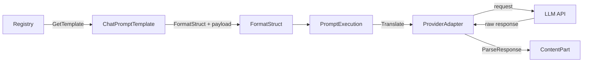

# prompty

[](https://pkg.go.dev/github.com/skosovsky/prompty)

Prompt template management for Go LLM applications. Provider-agnostic: load templates, render with typed payloads, then map to OpenAI, Anthropic, Gemini, or Ollama via adapters.

## Features

- **Domain model**: `ContentPart` (text, image, tool call/result), `ChatMessage`, `ToolDefinition`, `PromptExecution` with metadata; open-ended roles in manifests (validation in adapters)
- **Media**: `exec.ResolveMedia(ctx)` downloads image URLs into `MediaPart.Data` before sending to adapters that require inline data (Anthropic, Ollama); OpenAI and Gemini accept URL natively
- **Templating**: `text/template` with fail-fast validation, `PartialVariables`, optional messages, chat history splicing
- **Template functions**: `truncate_chars`, `truncate_tokens`, `render_tools_as_xml` / `render_tools_as_json` for tool injection
- **Registries**: load manifests from filesystem (`fileregistry`), embed (`embedregistry`), or remote HTTP/Git (`remoteregistry`) with TTL cache
- **Adapters**: map `PromptExecution` to provider request types (OpenAI, Anthropic, Gemini, Ollama); parse responses back to `[]ContentPart`
- **Observability**: `PromptMetadata` (ID, version, description, tags, environment) on every execution

## Quick Start

```go
package main

import (
    "context"
    "fmt"

    "github.com/skosovsky/prompty"
)

func main() {
    tpl, err := prompty.NewChatPromptTemplate(
        []prompty.MessageTemplate{
            {Role: prompty.RoleSystem, Content: "You are {{ .bot_name }}."},
            {Role: prompty.RoleUser, Content: "{{ .query }}"},
        },
        prompty.WithPartialVariables(map[string]any{"bot_name": "HelperBot"}),
    )
    if err != nil {
        panic(err)
    }
    type Payload struct {
        Query string `prompt:"query"`
    }
    ctx := context.Background()
    exec, err := tpl.FormatStruct(ctx, &Payload{Query: "What is 2+2?"})
    if err != nil {
        panic(err)
    }
    fmt.Println(exec.Messages[0].Content[0].(prompty.TextPart).Text)
    fmt.Println(exec.Messages[1].Content[0].(prompty.TextPart).Text)
}
```

## Registries

| Package | Description |
|---------|-------------|
| `github.com/skosovsky/prompty/fileregistry` | Load YAML manifests from a directory; lazy load with cache; `Reload()` to clear cache |
| `github.com/skosovsky/prompty/embedregistry` | Load from `embed.FS` at build time; eager load; no mutex |
| `github.com/skosovsky/prompty/remoteregistry` | Fetch via `Fetcher` (HTTP or Git); TTL cache; `Evict`/`EvictAll`; `Close()` for resource cleanup |

Template name and environment resolve to `{name}.{env}.yaml` (or `.yml`), with fallback to `{name}.yaml`. Name must not contain `':'`.

## Adapters

| Package | Translate result | Notes |
|---------|------------------|--------|
| `github.com/skosovsky/prompty/adapter/openai` | `*openai.ChatCompletionNewParams` | Tools, images (URL/base64), tool calls |
| `github.com/skosovsky/prompty/adapter/anthropic` | `*anthropic.MessageNewParams` | Images as base64 only |
| `github.com/skosovsky/prompty/adapter/gemini` | `*gemini.Request` | Model set at call site |
| `github.com/skosovsky/prompty/adapter/ollama` | `*api.ChatRequest` | Native Ollama tools |

Each adapter implements `Translate(ctx, exec) (any, error)` and `TranslateTyped(ctx, exec)` for the concrete type; `ParseResponse(ctx, raw)` returns `[]prompty.ContentPart`; `ParseStreamChunk(ctx, rawChunk)` returns stream parts or `ErrStreamNotImplemented`. Use `adapter.TextFromParts` and `adapter.ExtractModelConfig` for helpers. **Media:** OpenAI and Gemini accept image URL in `MediaPart` natively. For Anthropic and Ollama (base64 only), call `exec.ResolveMedia(ctx)` before `Translate` when using image URLs; otherwise the adapter returns `adapter.ErrMediaNotResolved`. ResolveMedia fetches over HTTPS with size limit and fills `Data`/`MIMEType` (image type only).

## Architecture



Pipeline: **Registry** → **Template** + typed payload → **Fail-fast validation** → **Rendering** (with tool injection) → **PromptExecution** → **Adapter** → LLM API. HTTP/transport is the caller’s responsibility.

## Template functions

- `truncate_chars .text 4000` — trim by rune count
- `truncate_tokens .text 2000` — trim by token count (uses `TokenCounter` from template options; default `CharFallbackCounter`)
- `render_tools_as_xml .Tools` / `render_tools_as_json .Tools` — inject tool definitions into the prompt (e.g. for local Llama)

## Development

This repo uses **Go Workspaces** (`go.work`). The root and all adapter/registry submodules must be listed there so that changes to the core `prompty` package and adapters compile together in one PR without publishing intermediate versions.

**Pre-check:** Before changing interfaces in the root module, run from repo root:

```bash
go work sync
go build ./...
cd adapter/openai && go build . && cd ../..
cd adapter/anthropic && go build . && cd ../..
cd adapter/gemini && go build . && cd ../..
cd adapter/ollama && go build . && cd ../..
cd remoteregistry/git && go build . && cd ../..
```

Ensure `go.work` includes: `.`, `./adapter/openai`, `./adapter/anthropic`, `./adapter/gemini`, `./adapter/ollama`, `./remoteregistry/git`.

## License

MIT. See [LICENSE](LICENSE).
