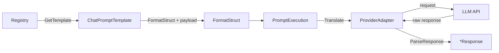

# prompty

[](https://pkg.go.dev/github.com/skosovsky/prompty)

**TL;DR** — prompty is a library for prompt management, templating, and unified interaction with LLMs in Go. It supports loading prompts from files, Git, or HTTP and works with multiple backends (OpenAI, Anthropic, Gemini, Ollama) without locking you to a single vendor.

## Modules and installation

The project is split into multiple Go modules. Install only what you need:

| Layer   | Package | Install |
|---------|---------|---------|
| Core    | prompty (templates, registries in-tree) | `go get github.com/skosovsky/prompty` |
| Adapters | OpenAI  | `go get github.com/skosovsky/prompty/adapter/openai` |
|         | Gemini  | `go get github.com/skosovsky/prompty/adapter/gemini` |
|         | Anthropic | `go get github.com/skosovsky/prompty/adapter/anthropic` |
|         | Ollama  | `go get github.com/skosovsky/prompty/adapter/ollama` |
| Registries | Git (remote) | `go get github.com/skosovsky/prompty/remoteregistry/git` |

`fileregistry` and `embedregistry` are part of the core module (`github.com/skosovsky/prompty`).

## Quick Start

Minimal example: create an `Invoker` from an adapter, format a prompt, call `Execute`, and read the response text. Requires `OPENAI_API_KEY` in the environment.

```go
package main

import (
	"context"
	"fmt"
	"log"
	"os"

	"github.com/openai/openai-go/v3"
	"github.com/openai/openai-go/v3/option"
	"github.com/skosovsky/prompty"
	"github.com/skosovsky/prompty/adapter"
	openaiadapter "github.com/skosovsky/prompty/adapter/openai"
)

func main() {
	adp := openaiadapter.New(openaiadapter.WithClient(
		openai.NewClient(option.WithAPIKey(os.Getenv("OPENAI_API_KEY")))),
	)
	client := adapter.NewClient(adp)

	exec := prompty.SimpleChat("You are a helpful assistant.", "What is 2+2?")
	resp, err := client.Execute(context.Background(), exec)
	if err != nil {
		log.Fatal(err)
	}
	fmt.Println(resp.Text())
}
```

## Main abstractions

- **Registry** — supplies `ChatPromptTemplate` by id (from files, embed, or remote). Interface: `GetTemplate(ctx, id) (*ChatPromptTemplate, error)`.
- **Adapter** — maps `PromptExecution` to a provider request and parses the response. Recommended: `adapter.NewClient(providerAdapter)` → `client.Execute(ctx, exec)` → `resp.Text()`. Low-level: `Translate` → `Execute` → `ParseResponse`. For streaming use `ExecuteStream`; adapters implement `StreamerAdapter.ExecuteStream` for native streaming.
- **Templating** — `ChatPromptTemplate` is built from message templates and optional tools; you pass a typed payload (struct with `prompt` tags) to `FormatStruct(payload)` to get a `PromptExecution`. Registries can load manifests (JSON or YAML) and support `WithPartials` for shared `{{ template "name" }}` partials. Template functions (funcmaps) include `truncate_chars`, `truncate_tokens`, `render_tools_as_xml`, `render_tools_as_json`, `escapeXML`, and `randomHex`.

Pipeline: **Registry** → **Template** + payload → **PromptExecution** → **Adapter** → provider API. HTTP/transport is the caller’s responsibility.

## Features

- **Domain model**: `ContentPart` (text/media/tool call/result), `ChatMessage`, `ToolDefinition`, `PromptExecution` with metadata; open-ended roles in manifests (validation in adapters). Prompt caching uses `CacheControl` on message and/or part level (`cache_control` in manifests). **Execution-level provider knobs:** use `PromptExecution.ModelOptions.ProviderSettings` (e.g. `gemini_search_grounding` for Gemini).
- **Media**: `exec.ResolvedMedia(ctx, fetcher)` returns a cloned execution with `MediaPart.Data` filled via a `Fetcher` (e.g. `mediafetch.DefaultFetcher{}`); use it before `Translate` for adapters that require inline data (for example Ollama, and Anthropic for unsupported URL media shapes). OpenAI and Gemini accept URL natively.
- **Templating**: `text/template` with fail-fast validation, `PartialVariables`, optional messages, chat history splicing. **DRY:** registries support `WithPartials(pattern)` so manifests can use `{{ template "name" }}` with shared partials (e.g. `_partials/*.tmpl`).
- **Template functions**: `truncate_chars`, `truncate_tokens`, `render_tools_as_xml` / `render_tools_as_json` for tool injection.
- **Registries**: load manifests from filesystem (`fileregistry`), embed (`embedregistry`), or remote HTTP/Git (`remoteregistry`). Remote cache is explicit via `remoteregistry.WithCache(...)`.
- **Adapters**: map `PromptExecution` to provider request types (OpenAI, Anthropic, Gemini, Ollama); parse responses back to `[]ContentPart`. Tool result is multimodal: `ToolResultPart.Content` is `[]ContentPart` (text and/or images). Adapters that do not support media in tool results return `ErrUnsupportedContentType` when `MediaPart` is present in `ToolResultPart.Content`.
- **Observability**: `PromptMetadata` (ID, version, description, tags, environment) on every execution.

## Registries

| Package | Description |
|---------|-------------|
| `github.com/skosovsky/prompty/fileregistry` | Load manifests (JSON or YAML via WithParser) from a directory; lazy load with cache; `Reload()` to clear cache; `WithPartials(relativePattern)` for `{{ template "name" }}` |
| `github.com/skosovsky/prompty/embedregistry` | Load from `embed.FS` at build time; eager load; no mutex; `WithPartials(pattern)` for shared partials |
| `github.com/skosovsky/prompty/remoteregistry` | Fetch via `Fetcher` (HTTP or Git); explicit cache via `WithCache`; `Close()` for resource cleanup |

All three registries also implement optional `prompty.Lister` (`List(ctx)`) and `prompty.Statter` (`Stat(ctx, id)`). When you have a variable of type `prompty.Registry` and need to list IDs or get template metadata, use a type assertion: `if l, ok := reg.(prompty.Lister); ok { ids, err := l.List(ctx); ... }`.

Template name and environment resolve to `{name}.{env}.json`, `{name}.{env}.yaml` (or `.yml`), with fallback to `{name}.json`, `{name}.yaml`. Name must not contain `':'`.

## Adapters

| Package | Translate result | Notes |
|---------|------------------|--------|
| `github.com/skosovsky/prompty/adapter/openai` | `*openai.ChatCompletionNewParams` | Tools, MIME-routed media (image/audio/file), tool calls |
| `github.com/skosovsky/prompty/adapter/anthropic` | `*anthropic.MessageNewParams` | `image/*` and PDF media (base64 or URL), `text/plain` document blocks (base64), tool calls |
| `github.com/skosovsky/prompty/adapter/gemini` | `*gemini.Request` | Default model + overrides (`WithModel`, `ModelOptions.Model`); generic media URI/bytes |
| `github.com/skosovsky/prompty/adapter/ollama` | `*api.ChatRequest` | Native Ollama tools |

Each adapter implements `Translate(exec) (Req, error)` where Req is the provider request type; `ParseResponse(raw)` returns `*prompty.Response`; use `resp.Text()` for plain text. `PromptExecution.ModelOptions` carries typed model overrides such as `Model`, `Temperature`, `MaxTokens`, `TopP`, and `Stop`. **Tool result:** `ToolResultPart.Content` is `[]ContentPart` (multimodal). Adapters that do not support media in tool results return `adapter.ErrUnsupportedContentType` when `MediaPart` is present. **Media:** OpenAI and Gemini can map URL media natively for supported types; Anthropic supports URL inputs for `image/*` and `application/pdf`; Ollama requires resolved inline images. When URL media is unsupported by the target adapter, call `exec.ResolvedMedia(ctx, fetcher)` first; otherwise the adapter returns `adapter.ErrMediaNotResolved`. The core has no HTTP dependency; the default implementation lives in `mediafetch`.

## Architecture


```mermaid
flowchart LR
    Registry[Registry]
    Template[ChatPromptTemplate]
    Format[FormatStruct]
    Exec[PromptExecution]
    Adapter[ProviderAdapter]
    API[LLM API]

    Registry -->|GetTemplate| Template
    Template -->|FormatStruct + payload| Format
    Format --> Exec
    Exec -->|Translate| Adapter
    Adapter -->|request| API
    API -->|raw response| Adapter
    Adapter -->|ParseResponse| Response["*Response"]
```

Pipeline: **Registry** → **Template** + typed payload → **Fail-fast validation** → **Rendering** (with tool injection) → **PromptExecution** → **Adapter** → LLM API. HTTP/transport is the caller’s responsibility.

## Resilience, timeouts, and structured output

**Separation of concerns:** prompty focuses on the prompt domain and a **single** provider round-trip per call (`Execute`, `ExecuteWithStructuredOutput`, `GenerateStructured`). It does **not** implement retry loops, backoff, or transport-level timeouts inside the core.

- **`GenerateStructured[T]`** runs one structured attempt (same as `NewExecution` + `ExecuteWithStructuredOutput[T]`). There is no `WithRetries` option anymore (breaking change): drive repetition from your own loop or middleware.
- **`NewStructuredExecutor[T](invoker, exec)`** returns a closure `func(context.Context) (*T, error)` that keeps a **working copy** of `exec`. On `*ValidationError` or `*ToolCallError`, it appends the assistant turn and feedback/tool results to that copy, then returns the **original** error. The next call to the closure sees the updated history—useful for an outer orchestrator (see below) without baking policy into prompty.

**Timeouts and HTTP:** adapters do not set `context.WithTimeout` or client `Timeout` for you; the request honors only the `context.Context` you pass. Configure HTTP deadlines and transports when you construct the vendor SDK (for example OpenAI: `openai.NewClient(option.WithHTTPClient(httpClient))`). You can also wrap `Invoker` with timeouts or retries outside this library.

**Illustrative outer retry** (pseudo-code; `routery` is not a dependency of this repo—use your own retry helper or library):

```go
step := prompty.NewStructuredExecutor[MyDTO](invoker, exec)
var out *MyDTO
var err error
for attempt := 0; attempt < maxAttempts; attempt++ {
	out, err = step(ctx)
	if err == nil {
		break
	}
	if _, ok := err.(*prompty.ValidationError); ok {
		continue
	}
	if _, ok := err.(*prompty.ToolCallError); ok {
		continue
	}
	break
}
```

## Template functions

- `truncate_chars .text 4000` — trim by rune count
- `truncate_tokens .text 2000` — trim by token count (uses `TokenCounter` from template options; default `CharFallbackCounter`)
- `render_tools_as_xml .Tools` / `render_tools_as_json .Tools` — inject tool definitions into the prompt (e.g. for local Llama)
- `escapeXML` — escape `<`, `>`, `&`, `"`, `'` so user input does not break XML structure (see Prompt Security)
- `randomHex N` — cryptographically random hex string of N bytes (2N chars); for randomized delimiters

## Prompt Security (Data Isolation)

To prevent prompt injection (e.g. user input closing a `<patient_input>` tag), escape user content and use randomized delimiters so the model cannot guess them. Example in a message template:

```yaml
{{ $delim := randomHex 8 }}
<data_{{ $delim }}>
{{ .UserInput | escapeXML }}
</data_{{ $delim }}>
```

- **escapeXML** — uses `html.EscapeString`; keeps user text from being interpreted as markup.
- **randomHex** — e.g. `randomHex 8` yields a 16-character hex string; use in opening and closing tags so the delimiter is unpredictable.

See `examples/secure_prompt` for a runnable example.

## Development

This repo uses **Go Workspaces** (`go.work`). The root and all adapter/registry submodules must be listed there so that changes to the core `prompty` package and adapters compile together in one PR without publishing intermediate versions.

**Build and test** (from repo root):

```bash
go work sync
go build ./...
go test ./...
cd adapter/openai && go build . && go test . && cd ../..
cd adapter/anthropic && go build . && go test . && cd ../..
cd adapter/gemini && go build . && go test . && cd ../..
cd adapter/ollama && go build . && go test . && cd ../..
cd remoteregistry/git && go build . && go test . && cd ../..
```

Ensure `go.work` includes: `.`, `./adapter/openai`, `./adapter/anthropic`, `./adapter/gemini`, `./adapter/ollama`, `./remoteregistry/git`.

**Benchmarks:** the library is optimized for zero-allocation rendering (sync.Pool). To check allocs/op and B/op (and ensure PRs do not regress them), run:

```bash
go test -bench=BenchmarkFormatStruct -benchmem ./...
```

**Running examples locally:** `go.work` includes `./examples/basic_chat`, `./examples/git_prompts`, `./examples/funcmap_tools`, and `./examples/secure_prompt`. From the repo root run `go run ./examples/basic_chat` (or `go run ./examples/secure_prompt` for the data-isolation example). Or `cd` into an example dir and `go run .`. The secure_prompt example embeds its manifest and works from any working directory; it demonstrates both escapeXML and randomHex (randomized delimiters). Each example’s `go.mod` uses `replace` for local development; remove those when using a published module.

## License

MIT. See [LICENSE](LICENSE).
