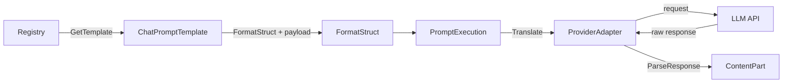

# prompty

[](https://pkg.go.dev/github.com/skosovsky/prompty)

**TL;DR** — prompty is a library for prompt management, templating, and unified interaction with LLMs in Go. It supports loading prompts from files, Git, or HTTP and works with multiple backends (OpenAI, Anthropic, Gemini, Ollama) without locking you to a single vendor.

## Modules and installation

The project is split into multiple Go modules. Install only what you need:

| Layer   | Package | Install |
|---------|---------|---------|
| Core    | prompty (templates, registries in-tree) | `go get github.com/skosovsky/prompty` |
| Adapters | OpenAI  | `go get github.com/skosovsky/prompty/adapter/openai` |
|         | Gemini  | `go get github.com/skosovsky/prompty/adapter/gemini` |
|         | Anthropic | `go get github.com/skosovsky/prompty/adapter/anthropic` |
|         | Ollama  | `go get github.com/skosovsky/prompty/adapter/ollama` |
| Registries | Git (remote) | `go get github.com/skosovsky/prompty/remoteregistry/git` |

`fileregistry` and `embedregistry` are part of the core module (`github.com/skosovsky/prompty`).

## Quick Start

Copy-paste friendly example: load a prompt (in-memory here), format with a payload, then call the OpenAI API via the adapter. Requires `OPENAI_API_KEY` in the environment.

```go
package main

import (
	"context"
	"fmt"
	"log"
	"os"

	"github.com/openai/openai-go/v3"
	"github.com/openai/openai-go/v3/option"
	"github.com/skosovsky/prompty"
	"github.com/skosovsky/prompty/adapter"
	openaiadapter "github.com/skosovsky/prompty/adapter/openai"
)

func main() {
	tpl, err := prompty.NewChatPromptTemplate(
		[]prompty.MessageTemplate{
			{Role: prompty.RoleSystem, Content: "You are {{ .bot_name }}."},
			{Role: prompty.RoleUser, Content: "{{ .query }}"},
		},
		prompty.WithPartialVariables(map[string]any{"bot_name": "HelperBot"}),
	)
	if err != nil {
		log.Fatal(err)
	}
	type Payload struct {
		Query string `prompt:"query"`
	}
	ctx := context.Background()
	exec, err := tpl.FormatStruct(ctx, &Payload{Query: "What is 2+2?"})
	if err != nil {
		log.Fatal(err)
	}

	adp := openaiadapter.New()
	params, err := adp.TranslateTyped(ctx, exec)
	if err != nil {
		log.Fatal(err)
	}
	client := openai.NewClient(option.WithAPIKey(os.Getenv("OPENAI_API_KEY")))
	resp, err := client.Chat.Completions.New(ctx, *params)
	if err != nil {
		log.Fatal(err)
	}
	parts, err := adp.ParseResponse(ctx, resp)
	if err != nil {
		log.Fatal(err)
	}
	fmt.Println(adapter.TextFromParts(parts))
}
```

## Main abstractions

- **Registry** — supplies `ChatPromptTemplate` by id (from files, embed, or remote). Interface: `GetTemplate(ctx, id) (*ChatPromptTemplate, error)`.
- **Adapter** — maps `PromptExecution` to a provider request and parses the response. Interface: `Translate(ctx, exec) (any, error)`, `ParseResponse(ctx, raw) ([]ContentPart, error)`, and optionally `ParseStreamChunk` (or `ErrStreamNotImplemented`).
- **Templating** — `ChatPromptTemplate` is built from message templates and optional tools; you pass a typed payload (struct with `prompt` tags) to `FormatStruct(ctx, payload)` to get a `PromptExecution`. Registries can load manifests (YAML) and support `WithPartials` for shared `{{ template "name" }}` partials. Template functions (funcmaps) include `truncate_chars`, `truncate_tokens`, `render_tools_as_xml`, `render_tools_as_json`.

Pipeline: **Registry** → **Template** + payload → **PromptExecution** → **Adapter** → provider API. HTTP/transport is the caller’s responsibility.

## Features

- **Domain model**: `ContentPart` (text, image, tool call/result), `ChatMessage`, `ToolDefinition`, `PromptExecution` with metadata; open-ended roles in manifests (validation in adapters). **Message-level:** provider-specific options are passed only via `ChatMessage.Metadata` (e.g. `anthropic_cache` for prompt caching, `gemini_search_grounding` for Gemini).
- **Media**: `exec.ResolveMedia(ctx, fetcher)` fills `MediaPart.Data` using a `Fetcher` (e.g. `mediafetch.DefaultFetcher{}`); use before `Translate` for adapters that require inline data (Anthropic, Ollama); OpenAI and Gemini accept URL natively.
- **Templating**: `text/template` with fail-fast validation, `PartialVariables`, optional messages, chat history splicing. **DRY:** registries support `WithPartials(pattern)` so manifests can use `{{ template "name" }}` with shared partials (e.g. `_partials/*.tmpl`).
- **Template functions**: `truncate_chars`, `truncate_tokens`, `render_tools_as_xml` / `render_tools_as_json` for tool injection.
- **Registries**: load manifests from filesystem (`fileregistry`), embed (`embedregistry`), or remote HTTP/Git (`remoteregistry`) with TTL cache.
- **Adapters**: map `PromptExecution` to provider request types (OpenAI, Anthropic, Gemini, Ollama); parse responses back to `[]ContentPart`. Tool result is multimodal: `ToolResultPart.Content` is `[]ContentPart` (text and/or images). Adapters that do not support media in tool results return `ErrUnsupportedContentType` when `MediaPart` is present in `ToolResultPart.Content`.
- **Observability**: `PromptMetadata` (ID, version, description, tags, environment) on every execution.

## Registries

| Package | Description |
|---------|-------------|
| `github.com/skosovsky/prompty/fileregistry` | Load YAML manifests from a directory; lazy load with cache; `Reload()` to clear cache; `WithPartials(relativePattern)` for `{{ template "name" }}` |
| `github.com/skosovsky/prompty/embedregistry` | Load from `embed.FS` at build time; eager load; no mutex; `WithPartials(pattern)` for shared partials |
| `github.com/skosovsky/prompty/remoteregistry` | Fetch via `Fetcher` (HTTP or Git); TTL cache; `Evict`/`EvictAll`; `Close()` for resource cleanup |

All three registries also implement optional `prompty.Lister` (`List(ctx)`) and `prompty.Statter` (`Stat(ctx, id)`). When you have a variable of type `prompty.Registry` and need to list IDs or get template metadata, use a type assertion: `if l, ok := reg.(prompty.Lister); ok { ids, err := l.List(ctx); ... }`.

Template name and environment resolve to `{name}.{env}.yaml` (or `.yml`), with fallback to `{name}.yaml`. Name must not contain `':'`.

## Adapters

| Package | Translate result | Notes |
|---------|------------------|--------|
| `github.com/skosovsky/prompty/adapter/openai` | `*openai.ChatCompletionNewParams` | Tools, images (URL/base64), tool calls |
| `github.com/skosovsky/prompty/adapter/anthropic` | `*anthropic.MessageNewParams` | Images as base64 only |
| `github.com/skosovsky/prompty/adapter/gemini` | `*gemini.Request` | Model set at call site |
| `github.com/skosovsky/prompty/adapter/ollama` | `*api.ChatRequest` | Native Ollama tools |

Each adapter implements `Translate(ctx, exec) (any, error)` and `TranslateTyped(ctx, exec)` for the concrete type; `ParseResponse(ctx, raw)` returns `[]prompty.ContentPart`; `ParseStreamChunk(ctx, rawChunk)` returns stream parts or `ErrStreamNotImplemented`. Use `adapter.TextFromParts` and `adapter.ExtractModelConfig` for helpers. **Tool result:** `ToolResultPart.Content` is `[]ContentPart` (multimodal). Adapters that do not support media in tool results return `adapter.ErrUnsupportedContentType` when `MediaPart` is present. **Media:** OpenAI and Gemini accept image URL in `MediaPart` natively. For Anthropic and Ollama (base64 only), call `exec.ResolveMedia(ctx, fetcher)` before `Translate` when using image URLs; pass a `Fetcher` (e.g. `mediafetch.DefaultFetcher{}` or a custom implementation). Otherwise the adapter returns `adapter.ErrMediaNotResolved`. The core has no HTTP dependency; the default implementation lives in `mediafetch`.

## Architecture


```mermaid
flowchart LR
    Registry[Registry]
    Template[ChatPromptTemplate]
    Format[FormatStruct]
    Exec[PromptExecution]
    Adapter[ProviderAdapter]
    API[LLM API]

    Registry -->|GetTemplate| Template
    Template -->|FormatStruct + payload| Format
    Format --> Exec
    Exec -->|Translate| Adapter
    Adapter -->|request| API
    API -->|raw response| Adapter
    Adapter -->|ParseResponse| ContentParts[ContentPart]
```

Pipeline: **Registry** → **Template** + typed payload → **Fail-fast validation** → **Rendering** (with tool injection) → **PromptExecution** → **Adapter** → LLM API. HTTP/transport is the caller’s responsibility.

## Template functions

- `truncate_chars .text 4000` — trim by rune count
- `truncate_tokens .text 2000` — trim by token count (uses `TokenCounter` from template options; default `CharFallbackCounter`)
- `render_tools_as_xml .Tools` / `render_tools_as_json .Tools` — inject tool definitions into the prompt (e.g. for local Llama)

## Development

This repo uses **Go Workspaces** (`go.work`). The root and all adapter/registry submodules must be listed there so that changes to the core `prompty` package and adapters compile together in one PR without publishing intermediate versions.

**Build and test** (from repo root):

```bash
go work sync
go build ./...
go test ./...
cd adapter/openai && go build . && go test . && cd ../..
cd adapter/anthropic && go build . && go test . && cd ../..
cd adapter/gemini && go build . && go test . && cd ../..
cd adapter/ollama && go build . && go test . && cd ../..
cd remoteregistry/git && go build . && go test . && cd ../..
```

Ensure `go.work` includes: `.`, `./adapter/openai`, `./adapter/anthropic`, `./adapter/gemini`, `./adapter/ollama`, `./remoteregistry/git`.

**Running examples locally:** `go.work` already includes `./examples/basic_chat`, `./examples/git_prompts`, and `./examples/funcmap_tools`. From the repo root run `go run ./examples/basic_chat` (or cd into an example dir and `go run .`). Each example’s `go.mod` uses `replace` for local development; remove those when using a published module.

## License

MIT. See [LICENSE](LICENSE).
