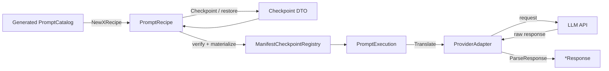

# prompty

[](https://pkg.go.dev/github.com/skosovsky/prompty)

**TL;DR** — prompty is a library for prompt management, templating, and unified interaction with LLMs in Go. It supports loading prompts from files, Git, or HTTP and works with multiple backends (OpenAI, Anthropic, Gemini, Ollama) without locking you to a single vendor.

## Modules and installation

The project is split into multiple Go modules. Install only what you need:

| Layer      | Package                                 | Install                                                  |
| ---------- | --------------------------------------- | -------------------------------------------------------- |
| Core       | prompty (templates, registries in-tree) | `go get github.com/skosovsky/prompty`                    |
| Adapters   | OpenAI                                  | `go get github.com/skosovsky/prompty/adapter/openai`     |
|            | Gemini                                  | `go get github.com/skosovsky/prompty/adapter/gemini`     |
|            | Anthropic                               | `go get github.com/skosovsky/prompty/adapter/anthropic`  |
|            | Ollama                                  | `go get github.com/skosovsky/prompty/adapter/ollama`     |
| Registries | Git (remote)                            | `go get github.com/skosovsky/prompty/remoteregistry/git` |

`fileregistry` and `embedregistry` are part of the core module (`github.com/skosovsky/prompty`).

## Quick Start

Primary runtime flow: create a generated recipe, checkpoint it, restore it, materialize `PromptExecution`, then call an adapter. The `prompts` package below is generated by `prompty-gen` from your manifest contracts.

```go
package main

import (
	"context"
	"fmt"
	"log"
	"os"

	"github.com/openai/openai-go/v3"
	"github.com/openai/openai-go/v3/option"
	"github.com/skosovsky/prompty"
	"github.com/skosovsky/prompty/adapter"
	openaiadapter "github.com/skosovsky/prompty/adapter/openai"
	"github.com/skosovsky/prompty/fileregistry"
	"github.com/skosovsky/prompty/parser/yaml"

	"your/module/prompts"
)

func main() {
	ctx := context.Background()
	reg, err := fileregistry.New("./prompts", fileregistry.WithParser(yaml.New()))
	if err != nil {
		log.Fatal(err)
	}

	catalog := prompts.NewPromptCatalog(reg)
	recipe, err := catalog.NewSupportAgentRecipe(ctx, prompts.SupportAgentInput{
		UserQuery: "What is 2+2?",
	})
	if err != nil {
		log.Fatal(err)
	}
	checkpoint, err := recipe.Checkpoint()
	if err != nil {
		log.Fatal(err)
	}
	restored, err := prompts.NewSupportAgentRecipeFromCheckpoint(checkpoint)
	if err != nil {
		log.Fatal(err)
	}
	exec, err := restored.ExecuteWithContract(ctx, reg, prompty.ToolContractFunc(func(name string) bool {
		return true
	}))
	if err != nil {
		log.Fatal(err)
	}

	adp := openaiadapter.New(openaiadapter.WithClient(
		openai.NewClient(option.WithAPIKey(os.Getenv("OPENAI_API_KEY")))),
	)
	client := adapter.NewClient(adp)

	resp, err := client.Execute(ctx, exec)
	if err != nil {
		log.Fatal(err)
	}
	text, err := resp.StrictText()
	if err != nil {
		log.Fatal(err)
	}
	fmt.Println(text)
}
```

For throwaway prototypes only, `prompty.SimpleChat(...)` can still build a direct `PromptExecution`; production integrations should use generated recipes/checkpoints.

## Main abstractions

- **PromptRecipe / ManifestDescriptor** — JSON-safe application checkpoint surface. A recipe stores typed input, optional late input, runtime compose values, and `{ID, Digest}`; restore it with `PromptRecipeFromCheckpoint` / generated `NewXRecipeFromCheckpoint`, then execute against a `ManifestCheckpointRegistry`.
- **Generated PromptCatalog / PromptIndex** — typed recipe constructors and a static id index for known prompts. Use generated recipe APIs as the primary runtime boundary; use `PromptIndex.NewRecipeFromJSON` only for explicit serialized payload dispatch.
- **Registry** — supplies manifests from files, embed, or remote and verifies checkpoint descriptors. Generated recipes call it to verify descriptor digest and rebuild the render plan at execution time. Direct `Registry.Plan(ctx, id, input)` is a low-level API for advanced integrations.
- **Adapter** — maps `PromptExecution` to a provider request and parses the response. Recommended: `adapter.NewClient(providerAdapter)` → `client.Execute(ctx, exec)` → `resp.StrictText()`. Low-level: `Translate` → `Execute` → `ParseResponse`. For streaming use `ExecuteStream`; adapters implement `StreamerAdapter.ExecuteStream` for native streaming. Runtime metadata and token budgets live behind `adapter.NewRuntimeClient(providerAdapter)`; `adapter.EstimateTokens(estimator, exec)` is strict-by-default (`ErrNoTokenEstimator` without a provider estimator).
- **Templating** — `ChatPromptTemplate` is built from message templates and optional tools. Generated recipes materialize it into `PromptExecution` at execution time. Template context is explicit: `{{ .Input.<field> }}` and `{{ .LateVars.<field> }}`. Registries load manifests (JSON or YAML), expand declarative `imports`/`layers`, and support `WithPartials` for shared `{{ template "name" }}` partials. Template functions (funcmaps) include `truncate_chars`, `truncate_tokens`, `render_tools_as_xml`, `render_tools_as_json`, `escapeXML`, and `randomHex`.

Pipeline: **generated recipe** → **checkpoint/restore** → **VerifyManifestDescriptor** → **registry-backed materialization** → **PromptExecution** → **Adapter** → provider API.

## Features

- **Domain model**: `ContentPart` (text/media/tool call/result), `ChatMessage`, `ToolDefinition`, `PromptExecution` with metadata; open-ended roles in manifests (validation in adapters). Prompt caching uses `CachePolicy` on message and/or part level (`cache_policy` in manifests). **Execution-level provider knobs:** use `PromptExecution.ModelOptions.ProviderSettings` (e.g. `gemini_search_grounding` for Gemini).
- **Media**: `exec.ResolvedMedia(ctx, fetcher)` returns a cloned execution with `MediaPart.Data` filled via a `Fetcher` (e.g. `mediafetch.DefaultFetcher{}`); use it before `Translate` for adapters that require inline data (for example Ollama, and Anthropic for unsupported URL media shapes). OpenAI and Gemini accept URL natively.
- **Templating**: `text/template` with fail-fast validation, `PartialVariables`, optional messages, chat history splicing. **DRY:** registries support `WithPartials(pattern)` so manifests can use `{{ template "name" }}` with shared partials (e.g. `_partials/*.tmpl`).
- **Template functions**: `truncate_chars`, `truncate_tokens`, `render_tools_as_xml` / `render_tools_as_json` for tool injection.
- **Registries**: load manifests from filesystem (`fileregistry`), embed (`embedregistry`), or remote HTTP/Git (`remoteregistry`). Remote cache is explicit via `remoteregistry.WithCache(...)`.
- **Adapters**: map `PromptExecution` to provider request types (OpenAI, Anthropic, Gemini, Ollama); parse responses back to `[]ContentPart`. Tool result is multimodal: `ToolResultPart.Content` is `[]ContentPart` (text and/or images). Adapters that do not support media in tool results return `ErrUnsupportedContentType` when `MediaPart` is present in `ToolResultPart.Content`.
- **Observability**: `PromptMetadata` (ID, version, description, tags, environment) on every execution.

## Registries

| Package                                       | Description                                                                                                                                                                 |
| --------------------------------------------- | --------------------------------------------------------------------------------------------------------------------------------------------------------------------------- |
| `github.com/skosovsky/prompty/fileregistry`   | Load manifests (JSON or YAML via WithParser) from a directory; lazy load with cache; `Reload()` to clear cache; `WithPartials(relativePattern)` for `{{ template "name" }}` |
| `github.com/skosovsky/prompty/embedregistry`  | Load from `embed.FS` at build time; eager load; no mutex; `WithPartials(pattern)` for shared partials                                                                       |
| `github.com/skosovsky/prompty/remoteregistry` | Fetch via `Fetcher` (HTTP or Git); explicit cache via `WithCache`; `Close()` for resource cleanup                                                                           |

All three registries also implement optional `prompty.Lister` (`List(ctx)`), `prompty.Statter` (`Stat(ctx, id)`), and `prompty.ManifestResolver` (`ResolveManifest(ctx, id)` — metadata only, no template AST). When you have a variable of type `prompty.Registry` and need list/stat/descriptor APIs, use a type assertion.

With `WithEnvironment(env)`, only `{name}.{env}.json|yaml|yml` are resolved (strict, no fallback to base `{name}`). Without env, `{name}.json|yaml|yml` are tried. Name must not contain `':'`.

## Adapters

| Package                                          | Translate result                  | Notes                                                                                      |
| ------------------------------------------------ | --------------------------------- | ------------------------------------------------------------------------------------------ |
| `github.com/skosovsky/prompty/adapter/openai`    | `*openai.ChatCompletionNewParams` | Tools, MIME-routed media (image/audio/file), tool calls                                    |
| `github.com/skosovsky/prompty/adapter/anthropic` | `*anthropic.MessageNewParams`     | `image/*` and PDF media (base64 or URL), `text/plain` document blocks (base64), tool calls |
| `github.com/skosovsky/prompty/adapter/gemini`    | `*gemini.Request`                 | Default model + overrides (`WithModel`, `ModelOptions.Model`); generic media URI/bytes     |
| `github.com/skosovsky/prompty/adapter/ollama`    | `*api.ChatRequest`                | Native Ollama tools                                                                        |

Each adapter implements `Translate(exec) (Req, error)` where Req is the provider request type; `ParseResponse(raw)` returns `*prompty.Response`; use `resp.StrictText()` for fail-closed plain text. `PromptExecution.ModelOptions` carries typed model overrides such as `Model`, `Temperature`, `MaxTokens`, `TopP`, and `Stop`. **Tool result:** `ToolResultPart.Content` is `[]ContentPart` (multimodal). Adapters that do not support media in tool results return `adapter.ErrUnsupportedContentType` when `MediaPart` is present. **Media:** OpenAI and Gemini can map URL media natively for supported types; Anthropic supports URL inputs for `image/*` and `application/pdf`; Ollama requires resolved inline images. When URL media is unsupported by the target adapter, call `exec.ResolvedMedia(ctx, fetcher)` first; otherwise the adapter returns `adapter.ErrMediaNotResolved`. The core has no HTTP dependency; the default implementation lives in `mediafetch`.

## Provider settings

Use `model_options.provider_settings` for vendor-specific knobs. The core keeps this map as-is in `ModelOptions.ProviderSettings`; provider key mapping lives in adapters.

Clean break contract: vendor keys must be inside `provider_settings`. Unknown top-level keys in `model_options` are rejected with a parse error.

```yaml
model_options:
  model: gpt-4o
  temperature: 0.3
  provider_settings:
    reasoning_effort: low
    seed: 42
```

Supported `provider_settings` keys:

- OpenAI: `presence_penalty`, `frequency_penalty`, `seed`, `logprobs`, `top_logprobs`, `reasoning_effort`
- Gemini: `top_k`, `presence_penalty`, `frequency_penalty`, `stop_sequences`, `thinking`, `thinking_budget`, `gemini_search_grounding`
- Anthropic: `top_k`, `stop_sequences`
- Ollama: `top_k`, `seed`, `num_ctx`, `repeat_penalty`

Provider settings validation is fail-closed: unknown keys or invalid values return `adapter.ErrInvalidProviderSettings` (no silent ignore).

## Architecture


```mermaid
flowchart LR
    Catalog[Generated PromptCatalog]
    Recipe[PromptRecipe]
    Checkpoint[Checkpoint DTO]
    Registry[ManifestCheckpointRegistry]
    Exec[PromptExecution]
    Adapter[ProviderAdapter]
    API[LLM API]

    Catalog -->|NewXRecipe| Recipe
    Recipe -->|Checkpoint / restore| Checkpoint
    Checkpoint --> Recipe
    Recipe -->|verify + materialize| Registry
    Registry --> Exec
    Exec -->|Translate| Adapter
    Adapter -->|request| API
    API -->|raw response| Adapter
    Adapter -->|ParseResponse| Response["*Response"]
```

Pipeline: **PromptCatalog.NewXRecipe(...)** → **recipe.Checkpoint()/restore** → **recipe.ExecuteWithContract(...)** → **PromptExecution** → **Adapter** → LLM API. Direct `Registry.Plan(...)` remains available as an advanced low-level path.

## Migration Notes

Regression gate: `make test`.

**Checkpoint ops:** compose manifests must list only resolvable import ids for `RecommendManifestDescriptor` / `VerifyManifestDescriptor` (all declared imports, including inactive conditional branches). **Compose caching:** `ManifestUsesComposeE` returns an error on corrupt bytes; cached registries bypass template cache conservatively on error.

## Recipe-First Runtime

```go
func buildExecution(ctx context.Context) (*prompty.PromptExecution, error) {
	reg, err := fileregistry.New("./prompts", fileregistry.WithParser(yaml.New()))
	if err != nil {
		return nil, err
	}

	catalog := prompts.NewPromptCatalog(reg)
	recipe, err := catalog.NewSupportAgentRecipe(ctx, prompts.SupportAgentInput{
		UserQuery: "Where is my order?",
	})
	if err != nil {
		return nil, err
	}

	checkpoint, err := recipe.Checkpoint() // JSON-safe DTO for storage.
	if err != nil {
		return nil, err
	}
	restored, err := prompts.NewSupportAgentRecipeFromCheckpoint(checkpoint)
	if err != nil {
		return nil, err
	}

	contract := prompty.ToolContractFunc(func(name string) bool {
		return runtimeTools.HasTool(name)
	})
	exec, err := restored.ExecuteWithContract(ctx, reg, contract)
	if err != nil {
		return nil, err
	}
	return exec, nil
}
```

Then execute `exec` via an adapter client (`adapter.NewClient(...)` or `adapter.NewRuntimeClient(...)`), including streaming if needed.

Compose-aware generated prompts require typed compose context:

```go
recipe, err := catalog.NewComposedConditionalMainRecipeWithComposeContext(ctx, prompts.ComposedConditionalMainInput{
	Query: "Where is my order?",
}, prompts.NewComposedConditionalMainComposeContext(true))
```

Advanced low-level path: use `Registry.Plan(...)` directly only when the application intentionally owns the render-plan boundary:

```go
type runtimeCompose struct {
	WorkspaceEnabled bool
}

func (c runtimeCompose) ComposeValues() prompty.ComposeValues {
	return prompty.NewComposeValuesFromPairs(
		prompty.ComposeBool("capabilities.workspace_enabled", c.WorkspaceEnabled),
	)
}

planInput, err := prompty.PlanInputFrom(struct {
	UserQuery string `prompt:"user_query"`
}{UserQuery: "Where is my order?"})
if err != nil {
	return err
}
planInput = prompty.PlanInputWithComposeContext(planInput, runtimeCompose{WorkspaceEnabled: true})
plan, err := reg.Plan(ctx, "main_agent", planInput)
if err != nil {
	return err
}
exec, err := plan.ExecuteWithContract(ctx, contract)
```

Clean-break rules:

- no `Registry.GetTemplate(...)` in production code
- no `ChatPromptTemplate.Format(...)` / `FormatStruct(...)`
- manifests must use `model_options` + contract-style `inputs`
- message layers use `layer_id` (not `source_id`)
- template context is explicit: `.Input.*` and `.LateVars.*`
- provider message normalization runs in adapters, not in `RenderPlan.Execute()`

### Composition And Runtime Additions

- **Declarative composition:** manifest `imports` + `layers` with `condition.match`; registries expand at `Plan` time using typed `ComposeValues` / generated `ComposeContext`.
- **Layers:** tag messages with `layer_id` / `layer_kind` (or define layers in manifest).
- **Provenance:** rendered messages carry `Provenance *MessageProvenance` (`LayerID`, `ManifestID`).
- **Late binding:** typed `WithLateInput` at core level and generated `*LateInput` + recipe `BindLate` (no JSON tunnel).
- **Checkpoints:** `ManifestDescriptor{ID, Digest}` instead of public compiled blobs.
- **Metadata:** `ResolveManifest` / `PromptCatalog.Descriptor` for lightweight manifest introspection (`WithResolveComposeContext` for runtime layer view).
- **Compose fixtures:** see [`fileregistry/testdata/prompts/composed_main.yaml`](fileregistry/testdata/prompts/composed_main.yaml) and [`composed_conditional_main.yaml`](fileregistry/testdata/prompts/composed_conditional_main.yaml).
- **Runtime schema:** `WithResponseFormatDefinition` / `WithResponseFormatFromStruct` overrides response format before execute.
- **Struct binding:** struct fields bind via explicit `prompt` tags; generated inputs emit those tags from manifest contract fields.

### Flat vs compose layers

Manifests use **either** top-level `messages` (flat) **or** `layers` with optional `imports` (compose). Declaring both is rejected — when migrating to compose, move every turn (including the user message) into `layers`:

```yaml
layers:
  - id: user_turn
    role: user
    content: "{{ .Input.query }}"
```

Flat manifests keep `messages` + optional `layer_id` per message. Compose manifests resolve imports transitively and attach `MessageProvenance` per expanded layer.

## Resilience, timeouts, and structured output

**Separation of concerns:** prompty focuses on the prompt domain and a **single** provider round-trip per call (`Execute`, `ExecuteWithStructuredOutput`, `GenerateStructured`). It does **not** implement retry loops, backoff, or transport-level timeouts inside the core.

- **`GenerateStructured[T]`** runs one structured attempt (same as `NewExecution` + `ExecuteWithStructuredOutput[T]`). There is no `WithRetries` option: drive repetition from your own loop or middleware.
- **`NewStructuredExecutor[T](invoker, exec)`** returns a closure `func(context.Context) (*T, error)` that keeps a **working copy** of `exec`. On `*ValidationError` or `*ToolCallError`, it appends the assistant turn and feedback/tool results to that copy, then returns the **original** error. The next call to the closure sees the updated history—useful for an outer orchestrator (see below) without baking policy into prompty.

**Timeouts and HTTP:** adapters do not set `context.WithTimeout` or client `Timeout` for you; the request honors only the `context.Context` you pass. Configure HTTP deadlines and transports when you construct the vendor SDK (for example OpenAI: `openai.NewClient(option.WithHTTPClient(httpClient))`). You can also wrap `Invoker` with timeouts or retries outside this library.

**Illustrative outer retry** (pseudo-code; use your own retry policy outside this library):

```go
step := prompty.NewStructuredExecutor[MyDTO](invoker, exec)
var out *MyDTO
var err error
for attempt := 0; attempt < maxAttempts; attempt++ {
	out, err = step(ctx)
	if err == nil {
		break
	}
	if _, ok := err.(*prompty.ValidationError); ok {
		continue
	}
	if _, ok := err.(*prompty.ToolCallError); ok {
		continue
	}
	break
}
```

## Template functions

- `truncate_chars .text 4000` — trim by rune count
- `truncate_tokens .text 2000` — trim by token count (uses `TokenCounter` from template options; default `CharFallbackCounter`)
- `render_tools_as_xml .Tools` / `render_tools_as_json .Tools` — inject tool definitions into the prompt (e.g. for local Llama)
- `escapeXML` — escape `<`, `>`, `&`, `"`, `'` so user input does not break XML structure (see Prompt Security)
- `randomHex N` — cryptographically random hex string of N bytes (2N chars); for randomized delimiters

## Prompt Security (Data Isolation)

To prevent prompt injection (e.g. user input closing a trusted XML-like tag), escape user content and use randomized delimiters so the model cannot guess them. Example in a message template:

```yaml
{{ $delim := randomHex 8 }}
<data_{{ $delim }}>
{{ .Input.UserInput | escapeXML }}
</data_{{ $delim }}>
```

- **escapeXML** — uses `html.EscapeString`; keeps user text from being interpreted as markup.
- **randomHex** — e.g. `randomHex 8` yields a 16-character hex string; use in opening and closing tags so the delimiter is unpredictable.

See `examples/secure_prompt` for a runnable example.

## Development

This repo uses **Go Workspaces** (`go.work`). The root and all adapter/registry submodules must be listed there so that changes to the core `prompty` package and adapters compile together in one PR without publishing intermediate versions.

**Build and test** (from repo root):

```bash
go work sync
go build ./...
go test ./...
cd adapter/openai && go build . && go test . && cd ../..
cd adapter/anthropic && go build . && go test . && cd ../..
cd adapter/gemini && go build . && go test . && cd ../..
cd adapter/ollama && go build . && go test . && cd ../..
cd remoteregistry/git && go build . && go test . && cd ../..
```

Ensure `go.work` includes: `.`, `./adapter/openai`, `./adapter/anthropic`, `./adapter/gemini`, `./adapter/ollama`, `./remoteregistry/git`.

**Benchmarks:** the library is optimized for zero-allocation rendering (sync.Pool). To check allocs/op and B/op (and ensure PRs do not regress them), run:

```bash
go test -bench=BenchmarkRenderPlanExecute -benchmem ./...
```

**Running examples locally:** `go.work` includes `./examples/basic_chat`, `./examples/git_prompts`, `./examples/funcmap_tools`, and `./examples/secure_prompt`. From the repo root run `go run ./examples/basic_chat` (or `go run ./examples/secure_prompt` for the data-isolation example). Or `cd` into an example dir and `go run .`. The secure_prompt example embeds its manifest and works from any working directory; it demonstrates both escapeXML and randomHex (randomized delimiters). Each example’s `go.mod` uses `replace` for local development; remove those when using a published module.

## License

MIT. See [LICENSE](LICENSE).
